<h1>Creation of a microservice for managing bank accounts</h1>
<ol>
<li>Creation of a Spring Boot project with Web, Spring Data JPA, H2, Lombok dependencies</li>
<li>Creation of the JPA Account entity</li>
<li>Testing the DAO layer</li>
<li>Creation of the Restfull Web service which allows you to manage accounts</li>
<li>Testing the micro-service web using a REST client like Postman</li>
<li>Generate and test Swagger documentation for Web service Rest APIs</li>
<li>Exposing a Restful API using Spring Data Rest by leveraging projections</li>
<li>Creation DTOs and Mappers</li>
<li>Creation the Service (business) and microservice layer</li>
<li>Creation of graphQL web service</li>
</ol>
   
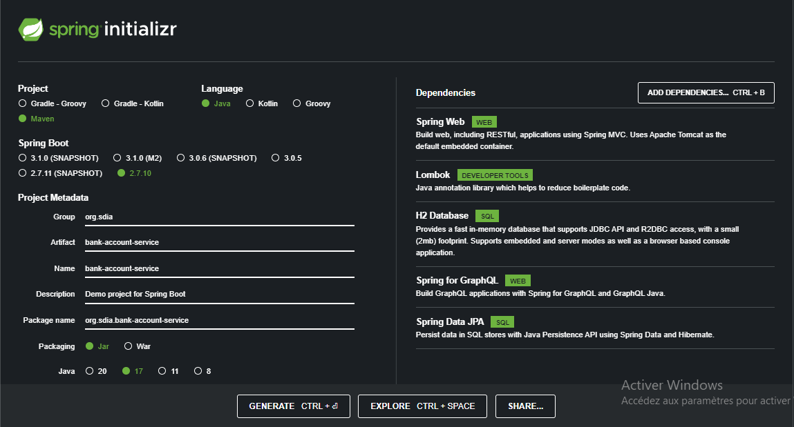   
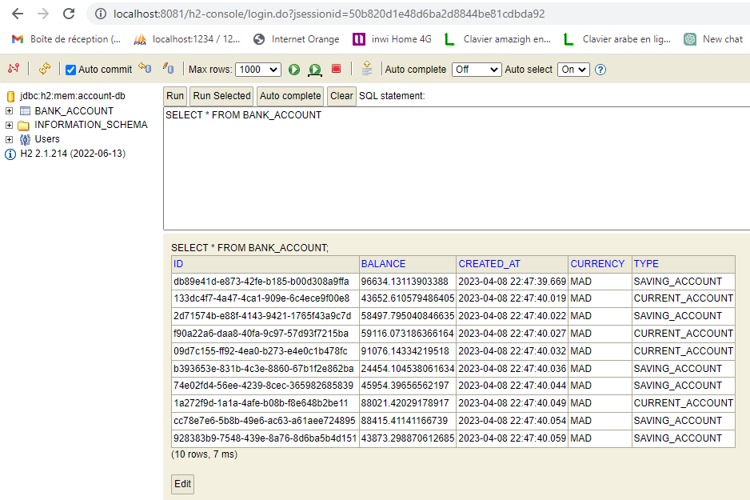   
   
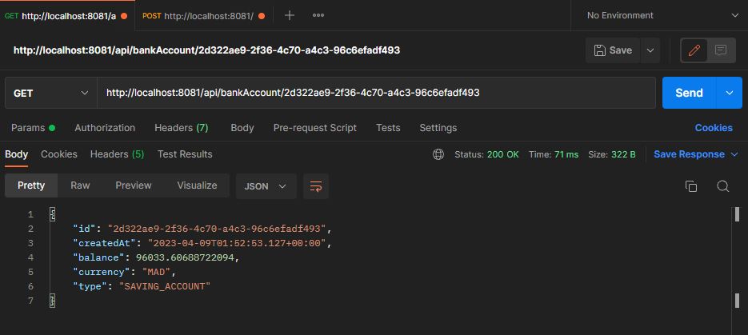   
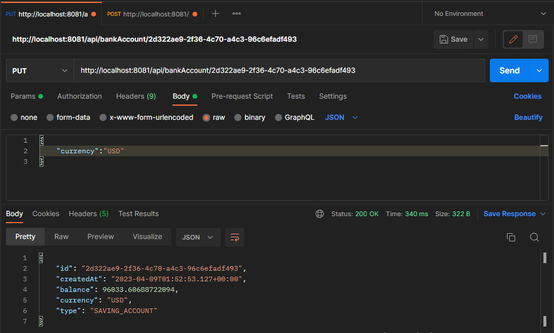   
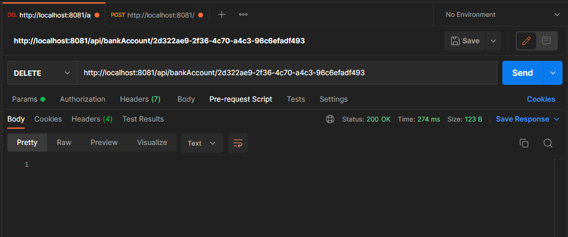   
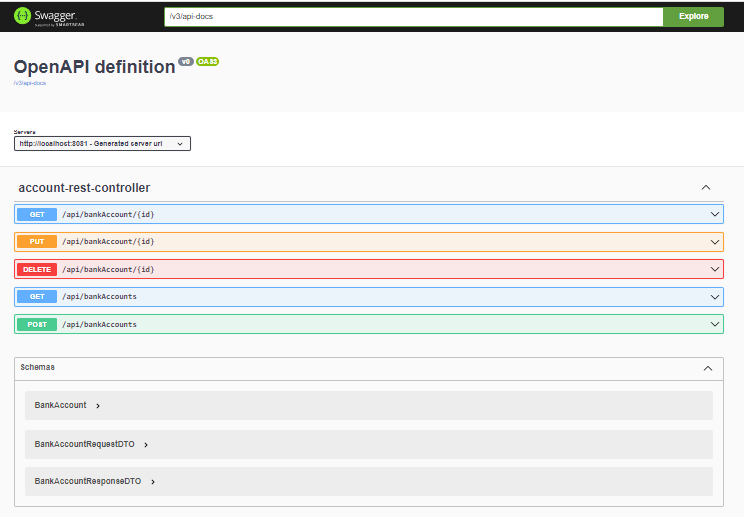   
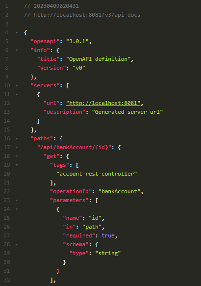   
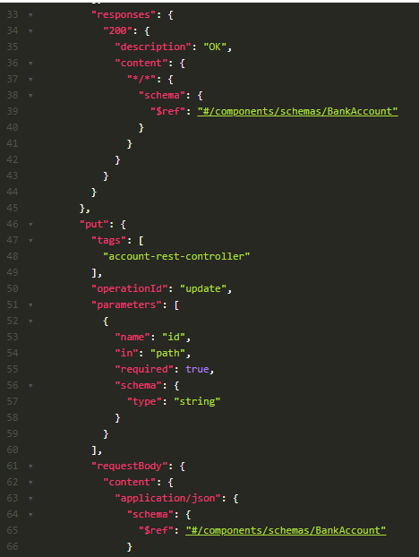   
... 
... 
...   
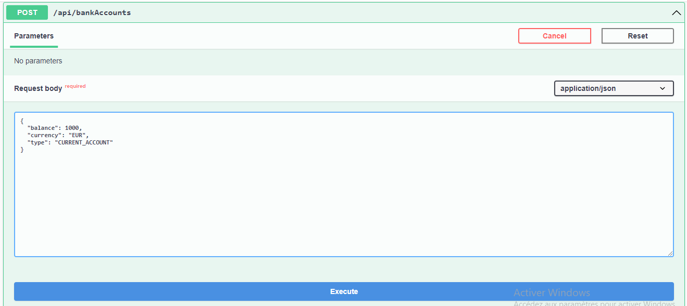   
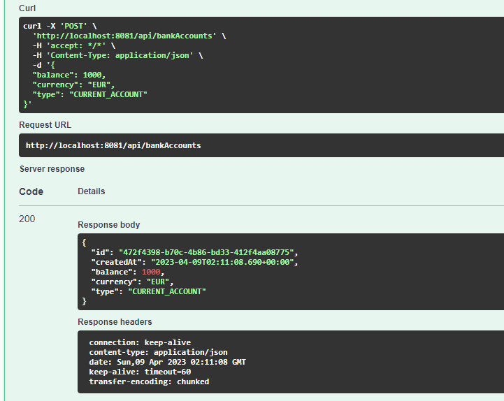   
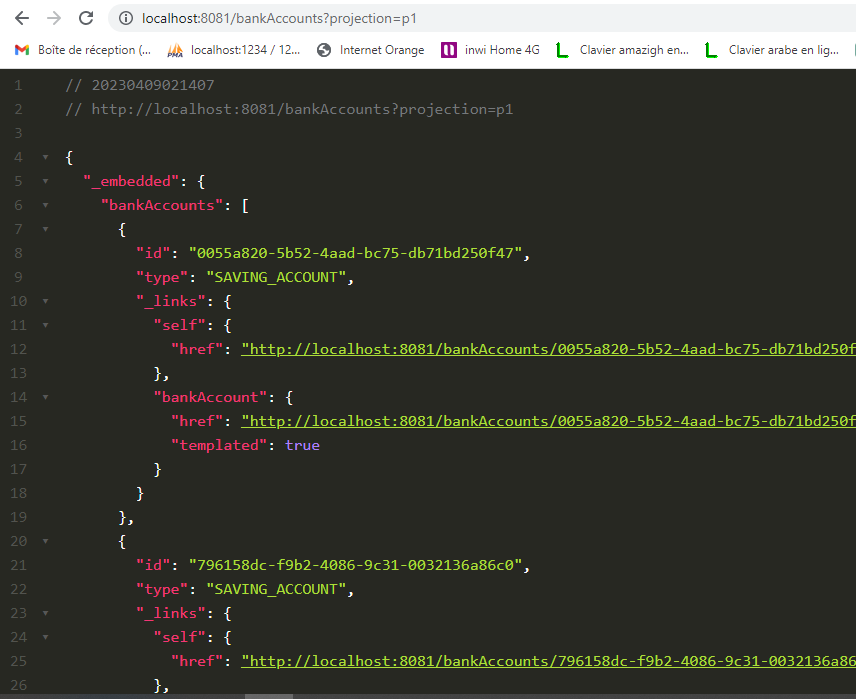   
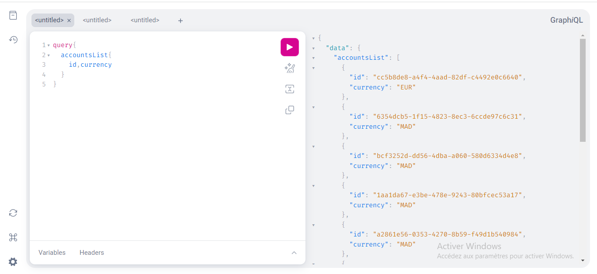   
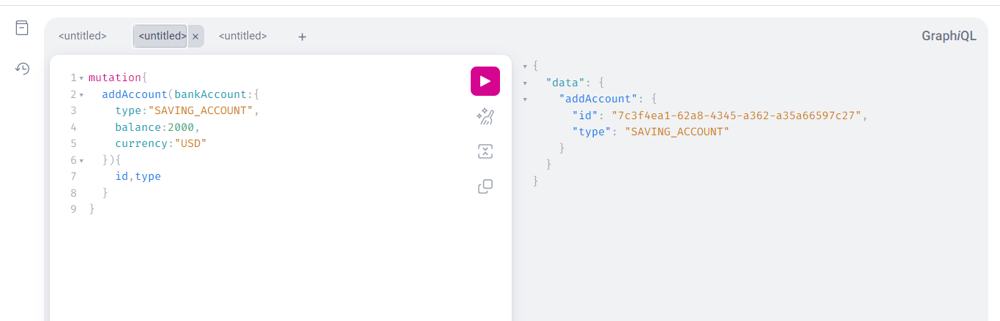   
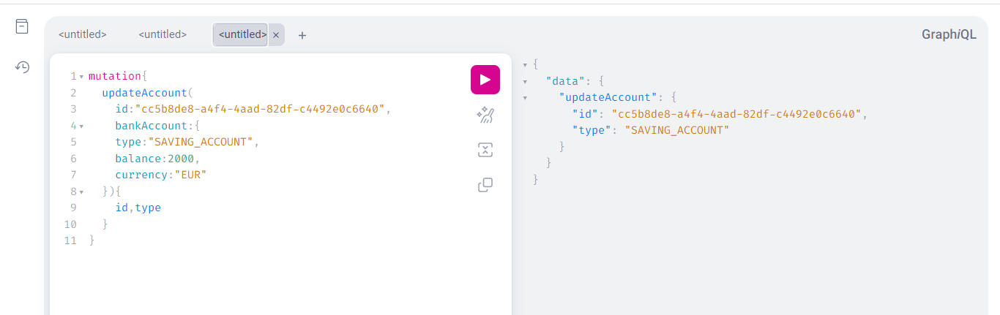   
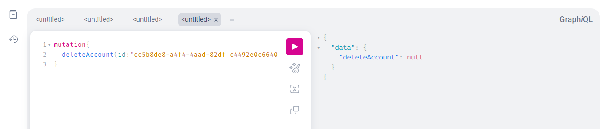   